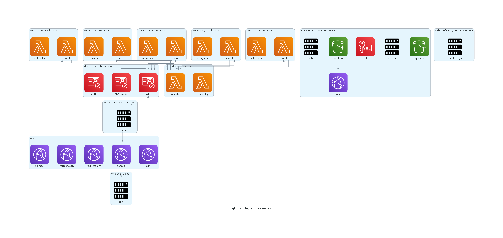

---
---
import Admonition from 'react-admonitions';

# v8.0.0 ( Jan 2021 )

Welcome to our first release of 2021, we've been a bit late on our releases so this one has a lot of changes. We will touch on the highlights here and you can discover the rest in our new repo changelogs

## Engine Updates

In this release there has been a big focus on aligning the core to well defined boundaries so that we can make hamlet as scalable and customisable as possible. Following on from those changes we have been able to implement a number of new features as a result

### Entrances and Flows

Previously the way to produce a different set of outputs in hamlet involved writing a new entrypoint template which was invoked at the start of generation process. This file had to be stored in the engine which meant that only the outputs defined in the engine were available. Entrances replace this with a dynamically loaded entrypoint to the hamlet engine. This allows for plugin developers to create their own entrances which perform initialisation processes to generate different types of outputs.

Flows are the next step after an entrance is called, and they provide an initial bootstrapping processing which can be shared across multiple entrances. This allows you to perform a set of standard routines which will generate outputs

The shared provider currently offers two flows:

- **components** - This is our standard flow, in this flow we take the Components defined in a solution, generate their occurrences and then dynamically call the setup and state routines required to create outputs based on the contents of the occurrence. This is our primary flow and is used in most deployment circumstances
- **views** - The views flow is a more freeform processing tool and instead of assembling occurrences it calls straight to a dynamically loaded view macro. This is useful for generating information about hamlet including configuration schemas or details on what is included in a plugin

Day to day users won't notice this change but it offers quite a lot of power to developers of hamlet

### Layers

One of the features that makes hamlet unique in deployment tools is that you along with defining the physical infrastructure you require you also define the conceptual contextual information which controls how the infrastructure is deployed. This includes details of  deployment environments ( which can be broken into segments ), Cloud provider Accounts and Products. These provide information around how to deploy and identify your infrastructure in standardised way. These have been defined as layers and are now loaded into the engine using our standard composite object and dynamic loading approaches. This allows for provider specific layers and to also extend and document the existing layers that we have.

The current layers that we have defined are:

- Account - Represents a cloud provider account or subscription
- Environment - An instance of your deployed solution ( development, production ) etc
- Product - A collection of environments which implement a service
- Segment - A subsection of an environment, used when creating complex environments with a log of components
- Solution - The solution layer contains the infrastructure that is deployed into the environment
- Tenant - A collection of products and accounts

### Fragments moved to extensions

Fragments provide a way to extend the resources or configuration of a component through additional freemarker templates which are included into an occurrence during its generation processing. This change renames fragments to extensions and makes them a dynamically loaded macro. Fragments were previously assembled into a case statement and then the case statement was executed during the processing. This was difficult to troubleshoot and could lead to issues with overriding variable names. With the move the extensions, they are now defined as a macro which is invoked as part of the template generation process. The macro receives the context, which is made up of standard extension points that a component can offer to hamlet users and the occurrence structure. This provides users all of the information that we use to generate the deployment.

As part of this you can now define multiple extensions on a component which will be applied in order. Extensions can be included in plugins to allow for sharing of whole solutions through plugins

### JSON Schema Generation

We now generate a JSON schema for our configuration which allows for validation and documentation of our component configuration. The schema is generated through our new flows processing as a dedicated flow.
To see the schemas in action head to https://hamlet.io/reference/components

### Module Loading in Blueprints

Scenarios which allowed for the injection of hamlet blueprint ( settings, solution, definitions ) have now been renamed as modules. When originally implemented they could only be invoked through a plugin as part of its setup. With the move to modules they are now available to users.

Modules allow you to define sections of solution files which you would like to reuse across multiple solutions. The modules are written as freemarker template macros allowing you to dynamically modify your modules and accept configuration parameters as part of your solution. You can load, solution, settings and API definitions through modules

The AWS Provider has a couple of modules already

- [Cloudwatch Slack](https://github.com/hamlet-io/engine-plugin-aws/blob/1ad2c7d839e48346bdd50895a025d47a1468cb25/aws/modules/cloudwatchslack/module.ftl) - Is a module that you can load to enable the forwarding of cloudwatch alarms to slack channels. It includes 2 components, alert-slack and alert-topic along with the settings required to configure the lambda function including the slack channel to use
- [Log Consolidation](https://github.com/hamlet-io/engine-plugin-aws/blob/c47a117cd8f9036a184ccbdd8507b5efb515f53e/aws/modules/consolidatelogs/module.ftl) - Provides the required configuration and components to forward logs generated by all components to a central S3 bucket. This is useful for establishing centralised log stores across your AWS environment

Modules can be loaded through all Layers of your deployment allowing you to define hamlet wide modules or solution specific modules as required

### Plugin loading in Blueprints

Plugins/Providers implement the specific implementations of hamlet for a given cloud provider or implement different outputs and functionality which extend how hamlet works. Up until now the providers had to be loaded outside of hamlet and provided to hamlet through the GENERATION_PLUGIN_DIRS and GENERATION_PROVIDERS environment variables.

This change allows you to define plugins in your solution which will be loaded through the new `${GENERATION_DIR}/setup.sh` script. This script generates a contract outlining the plugins to be loaded and the script will clone them into your hamlet home drive (~/.hamlet/plugins) and provide the details of the plugins to the hamlet engine

Combining this with Module loading from blueprints allows for the creation of hamlet plugins which implement complicated deployments that can be easily shared.

An example of this can be seen in the [cloudfront-authorization-at-edge](https://github.com/hamlet-io/cloudfront-authorization-at-edge) which uses lambda@Edge for AWS to enable Cognito based authentication on CloudFront distributions. The repo contains both the hamlet plugin code and the code required for the lambda functions themselves.

To plugin includes a module called `cdnlambda` which includes a cdn component and the lambda functions which integrate with the cdn. To use this in my solution I would need to add the following to my solution:

```json
{
    "Solution" : {
        "Id" : "msw",
        "Name" : "msw",
        "Plugins" : {
            "cfcognito" : {
                "Enabled" : true,
                "Name" : "cfcognito",
                "Priority" : 50,
                "Required" : true,
                "Source" : "git",
                "Source:git" : {
                    "Url" : "https://github.com/hamlet-io/cloudfront-authorization-at-edge",
                    "Ref" : "master",
                    "Path" : "hamlet/cfcognito"
                }
            }
        },
        "Modules" : {
            "cdn" : {
                "Provider" : "cfcognito",
                "Name" : "cdnlambda",
                "Parameters" : {
                    "id" : {
                        "Key" : "id",
                        "Value" : "cdn"
                    },
                    "tier" : {
                        "Key" : "tier",
                        "Value" : "web"
                    },
                    "origin" : {
                        "Key" : "originLink",
                        "Value" : {
                            "Tier" : "web",
                            "Component" : "spa",
                            "Version" : "v1"
                        }
                    },
                    "userpool" : {
                        "Key" : "userpoolClientLink",
                        "Value" : {
                            "Tier" : "dir",
                            "Component" : "auth",
                            "Client" : "cdn"
                        }
                    }
                }
            }
        }
    }
}
```

The Plugins section says where the plugin is located which we use to setup the hamlet deployment
The Modules section defines an instance of the module you want to load, from the plugin. You can invoke the same module multiple times depending on how the module has been implemented. Each module offers its own configuration section to guide users in setting up the module

### Deployment Groups and Deployment Modes in Solution

To outline the dependencies between components in hamlet we place different components into levels

- segment contains components which are common across most deployments and will be used by most components in a solution such as networks
- solution contains components which are specific to this solution but don't have business logic such as database instances or storage buckets
- application contains components which are specific to this solution and do have business logic such as containers or websites

Previously the level a component was fixed to these three levels, with the introduction of Deployment Groups users can now define the deployment groups that a component belongs to as part of their solution. This allows you to create groups based on your requirements and to streamline the processing required for deployments. For example you might have an API Gateway, and a collection of Lambda functions which implement the API, you could place these units in the same group and then run deployments based on the group. This ensures that all the units are updated at the same time. Another example where this is useful is for utility lambda functions which might need to be available before the deployment of what used to be a solution level component.

Along with making deployment groups available in solutions we've also added the ability to define priorities to deployment units and groups which allow you to define the execution order of deployments in your solution. Previously we had an established convention which defined the order to run deployments in. Now this order has been defined in the solution and can be controlled in your solution file. This allows for the management of dependent components which require specific ordering to deploy without intervention

Lastly, deployment Modes allow you to define a particular deployment flow based on the deployment groups and their priorities. A Deployment mode consists of a filtered list of Deployment groups along with an action to perform on the units and how the priority will determine the order of execution.

Lets look at the default deployment modes and groups

```json
{
    "DeploymentGroups" : {
        "segment" : {
            "Priority" : 10,
            "Level" : "segment"
        },
        "solution" : {
            "Priority" : 100,
            "Level" : "solution"
        },
        "application" : {
            "Priority" : 200,
            "Level" : "application"
        }
    },
    "DeploymentModes" : {
        "update" : {
            "Operations" : [ "update" ],
            "Membership" : "priority",
            "Priority" : {
                "GroupFilter" : ".*",
                "Order" : "LowestFirst"
            }
        },
        "stop" : {
            "Operations" : [ "delete" ],
            "Membership" : "priority",
            "Priority" : {
                "GroupFilter" : ".*",
                "Order" : "HighestFirst"
            }
        }
    }
}
```

The `update` deployment uses the priority membership which determines the order to execute groups based on their configured priority. The groups are selected using a regex pattern defined in the GroupFilter and the Priority is LowestFirst. So if we ran a deployment the deployment would run the segment units first, then solution then application. The stop mode has the same group membership but reverses the Order so in this case we would delete the application units first, then solution and finally segment.

We also have an explicit membership configuration option which allows you to define a array of group ids in the order you want them executed

This feature allows for deployments to be defined and controlled through the solution file

## Resource Sets

Following on from Deployment groups, Resource sets define a deployment unit as part of a deployment group which includes resources based on their type rather than based on their component/ deployment unit membership. Resource sets are useful when you want to control the deployment of sensitive resources from the rest of the your component. This is commonly used to deploy log groups in AWS so that the logs can be kept for auditing purposes after the component itself is no longer required.

Resource sets are defined on a Deployment group and only include the nominated resource types for any component that belongs to that deployment group

## Management Contracts

Management contracts are the result of a number of the features mentioned above, Resource sets, Deployment Groups, and Entrances. The management contract provides an outline of all the deployment units and their groups and outline the order that a deployment should be executed. The management contract essentially outlines what needs to be done to deploy a solution from start to finish.

An example of where we use this is now in our hamlet python executor which implements the cli

In this command I've asked for a list of all deployments that are required when I use the update mode. You can see they are ordered based on the order we discussed in Deployment Groups

```bash
hamlet deploy list-deployments -m update
| DeploymentGroup   | DeploymentUnit   | DeploymentProvider   |
|-------------------|------------------|----------------------|
| segment           | baseline         | aws                  |
| segment           | iam              | aws                  |
| segment           | lg               | aws                  |
| segment           | eip              | aws                  |
| segment           | s3               | aws                  |
| segment           | cmk              | aws                  |
| segment           | vpc              | aws                  |
| segment           | igw              | aws                  |
| segment           | vpcendpoint      | aws                  |
| segment           | nat              | aws                  |
| segment           | ssh              | aws                  |
| solution          | eip              | aws                  |
| solution          | iam              | aws                  |
| solution          | lg               | aws                  |
| solution          | cdn-cdn          | aws                  |
| solution          | auth             | aws                  |
| application       | iam              | aws                  |
| application       | lg               | aws                  |
| application       | docs-v1          | aws                  |
| application       | cdn-lmb          | aws                  |
```

Now lets see what happens when we provide the stop mode

```bash
hamlet deploy list-deployments -m stop
| DeploymentGroup   | DeploymentUnit   | DeploymentProvider   |
|-------------------|------------------|----------------------|
| application       | docs-v1          | aws                  |
| application       | cdn-lmb          | aws                  |
| application       | iam              | aws                  |
| application       | lg               | aws                  |
| solution          | cdn-cdn          | aws                  |
| solution          | auth             | aws                  |
| solution          | eip              | aws                  |
| solution          | iam              | aws                  |
| solution          | lg               | aws                  |
| segment           | ssh              | aws                  |
| segment           | nat              | aws                  |
| segment           | igw              | aws                  |
| segment           | vpcendpoint      | aws                  |
| segment           | vpc              | aws                  |
| segment           | iam              | aws                  |
| segment           | lg               | aws                  |
| segment           | eip              | aws                  |
| segment           | s3               | aws                  |
| segment           | cmk              | aws                  |
| segment           | baseline         | aws                  |
```

The order is reversed. The deploy command section also includes two extra commands after list-deployments

- create-deployments - will create the deployment outputs based on this order
- run-deployments - will create the deployments and run the operation listed in the deployment mode

This will run all the deployments and create the infrastructure in the solution

```bash
hamlet deploy run-deployments -m update
```

This will delete everything

```bash
hamlet deploy run-deployments -m stop
```

This makes deployments much simpler to manage and guides users through the deployment process.

## Shared Plugin

### New Components

The following new components have been added into the shared plugin for implementation by our provider specific plugins

- **externalnetwork** - This component represents a network which will integrate with your solution defined network. The external network component itself is more a logical definition but its network connection sub components represent VPN connections and are implmented as such in the AWS provider
- **filetransfer** - A managed file transfer system, generally based on an SFTP or FTP style transfer
- **globaldb** - A Globally deployable NoSQL managed service, this would map to DynamoDB in AWS and CosmosDB in Azure
- **privateservice** - A private network endpoint which can be shared between cloud provider tenancies without the need for network peering or vpn connections
- **router** - A network aggregation service which allows for multiple networks to route between each other privately
- **secretstore** - A managed secret management service
- **mta** - A managed Mail Transfer Agent based on the SMTP service
- **queuehost**  - A managed instance of a message queue hosting solution, for example AmazonMQ for Rabbit

### External Image Sourcing

External image source is a new feature which has been added to the lambda and ecs components. This allows you to define the location of an external image ( zip URL for lambda or docker registry image for ecs ) as part of your component definition in your solution. When the component is deployed the image will be pulled from the external source and uploaded to your hamlet registry. We then use this copied image in the deployment.

This makes our modules easy to share as you don't need to share the build pipeline along with the infrastructure template. Instead you can build and publish the artefacts then include their URLs in the module and hamlet will handle getting the image ready to go

We will be extending this functionality to all application components in a future release

## Diagrams Plugin

The [Diagrams plugin](https://github.com/hamlet-io/engine-plugin-diagrams/) is a new official hamlet plugin which demonstrates a collection of the features we have introduced in this release. This plugin uses our flows and entrances processing to build out a new output aimed at representing the relationships between components.  You can then use this output to generate diagrams of the components in your solution and how they interact

This one needs an example.

Using the hamlet cli in my segment I can run the following which will create a solution overview for this environment

```bash
hamlet visual draw-diagram -l overview
```

From that I will get the following picture



This includes the all the components in my solution, including those loaded through my module and how they relate to each other. This is still in early development but its cool too see what we can do with these new features

## AWS Plugin

### Services

We added support for the following AWS services in this release

- amazonmq
  - Initial support for AmazonMQ focussing on what was required for the new Rabbit MQ service
- apigateway
  - Usage Throttling
  - TLS configuration
- SSM
  - Enabled support for all EC2 instances. The SSM IAM permissions are now added to all instances by default
- ECS
  - hostname
  - EFS mounting directly to the ECS task
  - Docker Health checks
  - ulimits
  - Placement Constraints
  - UDP support for Load balancers
  - Capacity Providers
- EFS
  - Access Points
  - IAM Access Policy
- AWS Transfer
  - initial support for SFTP based instances
- VPC
  - Support for VPN Gateways
- DynamoDb
  - extended support for standalone component
  - Secondary Indexes
- s3
  - KMS and SSE based support for encryption at rest
  - Replication to external accounts
- Secrets manager
  - Initial support for generating and storing secrets
  - CloudFormation ref support for for secret resolution
- Transit Gateway
  - Initial support for VPN and VPC based connections
- Cognito
  - save secrets as part of deployment

## Azure Plugin

Updates to the reference support and ongoing testing fixes

## Full Change Log

AS part of this release we have now moved to using the convectional commit format on all official hamlet repositories. As a result of this we now have a change log for each repository which you can see the full list of changes

- [engine](https://github.com/hamlet-io/engine/blob/v8.0.0/CHANGELOG.md)
- [engine-plugin-aws](https://github.com/hamlet-io/engine-plugin-aws/blob/v8.0.0/CHANGELOG.md)
- [engine-plugin-azure](https://github.com/hamlet-io/engine-plugin-azure/blob/v8.0.0/CHANGELOG.md)
- [engine-plugin-diagrams](https://github.com/hamlet-io/engine-plugin-diagrams/blob/v8.0.0/CHANGELOG.md)
- [executor-bash](https://github.com/hamlet-io/executor-bash/blob/v8.0.0/CHANGELOG.md)
- [executor-python](https://github.com/hamlet-io/executor-python/blob/v8.0.0/CHANGELOG.md)
