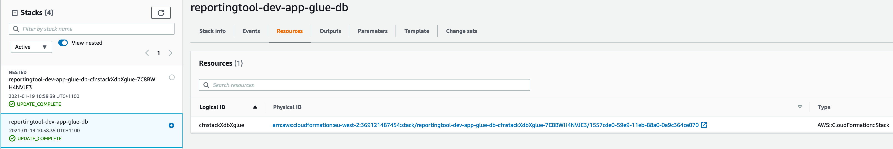
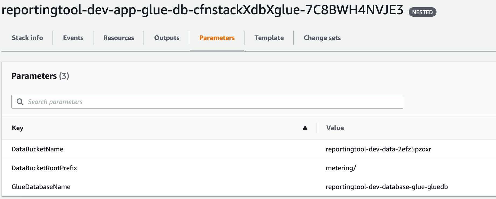
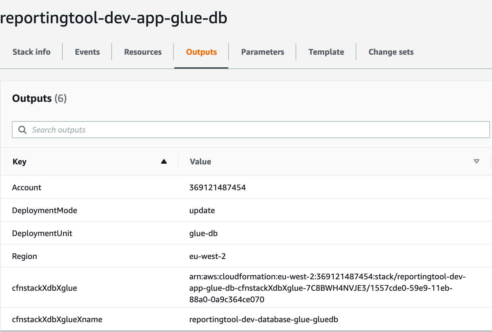

import Mermaid from '@theme/Mermaid';

hamlet has its own opinions on how things should be done. These opinions are formed by our community based on best practice ( including the best way to workaround things ) to get you working in the cloud as efficiently as possible. Sometimes you might want to try out something new that we don't support or a component we offer isn't quite right. In this series of posts, Prototyping Deployments you should get an idea of how hamlet helps with these deployments and integrates with the rest of your solution.
<!--truncate-->

When you reach this point we have some helpers in hamlet to get you going:

- **The template component**  - The template component uses a cloud provider declarative template and integrates it into hamlet. You can use hamlet to generate instances of the templates and create dynamic parameters based on the data available from hamlet. This is really helpful when you have experience in creating declarative templates ( like CloudFormation ) or are testing out a concept provided from a public repository and you want to see how it works
- **The adaptor component** - We prefer to use declarative templates to run deployments in hamlet, however sometimes that doesn't quite fit how a tool or process works. The adaptor requirement allows you to provide a bash script which will be executed as part of the deployment process. Your script is sourced into a generated script, like the template component this allows you to provide dynamic parameters ( through environment variables ) to your script.

In this post we are going to look into the template component to deploy a complex template which is specific to a product

## Creating an AWS Glue Database for Resource Tracking

I recently worked on a product which was used for tracking people and the projects they are working on. The product is based on AWS and uses a number of native services including

- **[AWS Athena](https://aws.amazon.com/athena/)** for querying a collection of records stored in S3 which track the time different areas of the company work on projects. To provide effective results in Athena AWS recommends that you provide a data schema which it can use to map out data types and ensure that your data matches what you expect
- **[AWS Glue](https://aws.amazon.com/glue/)** which is a managed ETL ( extract, transform, load ) service that includes a data catalogue. Athena can use these Glue catalogs to build out the data structure of your S3 bucket and provide us with a SQL like interface over S3 using the schema in the Glue Catalog

The overall process is something like this

<Mermaid chart={`
    graph LR;
    quicksight[Reporting Client]
    athena[Athena]
    s3[S3 Bucket]
    dataCatalog[Glue Data Catalog]
    quicksight-->|runs SQL query|athena
    athena-->|collects data schema|dataCatalog
    athena-->|runs query against data|s3
`}/>

During the development of this reporting process one of the developers in the team created a CloudFormation template which deployed the data catalog. As someone looking after Cloud Deployments for the team this was great, I could see what they had already discovered, review the template and see what is required to get this going in production.

Working in hamlet we like to make a library of reusable components which capture the gotchas, recommendations and workarounds required to deploy a set of resources. So let's have a look at the [template](https://github.com/hamlet-io/docs-support/blob/v1.0.0/glue_cfn/glue.yml) and see what would be required to make this into a component.

Looking through the template, the `AWS::Glue::Table` the table is the core piece of functionality with most of the other resources providing support to this table

```yaml
AWSTemplateFormatVersion: '2010-09-09'
Description: 'Glue Database, Tables, Crawlers, Crawler IAM Role for WTMG'
Parameters:
  DataBucketName:
    Type: String
    Description: 'S3 bucket that holds data for providers'
  GlueDatabaseName:
    Type: String
    Description: 'Name of Glue Database'
    Default: 'metering-gosource'
...
Resources:
    GithubProviderTable:
        Type: AWS::Glue::Table
        Properties:
        CatalogId: !Ref AWS::AccountId
        DatabaseName: !Ref GlueDatabase
        TableInput:
            Name: github-issues
            Description: Github tasks reports
            TableType: EXTERNAL_TABLE
            Parameters: { 'classification': 'json', 'compressionType': 'none' }
            PartitionKeys:
            - Name: project
                Type: string
            - Name: repo
                Type: string
            StorageDescriptor:
            OutputFormat: org.apache.hadoop.hive.ql.io.HiveIgnoreKeyTextOutputFormat
            Columns:
                - Name: task_code
                Type: string
                - Name: task_id
                Type: string
                - Name: task_number
                Type: string
                - Name: task_repository
                Type: string
                - Name: task_url
                Type: string
                - Name: task_assignees
                Type: array<string>
                - Name: task_milestone
                Type: string
                - Name: task_created_by
                Type: string
                - Name: task_tags
                Type: array<string>
                - Name: task_title
                Type: string
                - Name: task_closed_at
                Type: date
                - Name: task_created_at
                Type: date
                - Name: project_code
                Type: string
                - Name: provider_name
                Type: string
                - Name: provider_alias
                Type: string
            InputFormat: org.apache.hadoop.mapred.TextInputFormat
            Location:
                !Join [
                '/',
                [
                    's3:/',
                    !Ref 'DataBucketName',
                    !Ref 'DataBucketRootPrefix',
                    'task/github/v2/processed/data'
                ]
                ]
            SerdeInfo:
                SerializationLibrary: org.openx.data.jsonserde.JsonSerDe
...
```

One thing that stands out on initial review is that the resource exposes a number of parameters that determine the type of content the table will hold. This configuration cannot be made generic because it is fundamental to the way the resource behaves. We could add support for different values within the component itself, but this would mean embedding product-specific configuration logic inside of our infrastructure.

Our hamlet infrastructure usually provides the base level platform where we deploy code artefacts which are executed by the platform. This doesn't quite fit that model. So instead of turning this template into a generic component what if we could treat this template as a code artefact, this way changes are promoted through environments and during the promotion process we re-apply the template with the latest updates.

This is where the template component comes in. The template component has some useful features to integrate your template resources with the rest of your hamlet deployment:

- The template is provided to hamlet through our zip file s3 registry, you nominate a root template file which hamlet calls from inside of a nested CloudFormation Template. This means you can provide your whole library of templates as a single image and then use instances to select the appropriate template to deploy
- You can provide template parameter values through solution level configuration and extensions. This means you can generate dynamic parameter values using links, environment details and anything else available in hamlet. Depending on what's in your template, hamlet can look after creating multiple instances of your template.
- We capture the outputs provided by the template and include them as part of the state of the component. This means other components can access details about the resources in your template allowing you to still use our standardised best practice components alongside your template

## Deploying through hamlet

Lets see what this looks like in hamlet:

1. Lets create a hamlet to test this out

    :::info
    You can skip this step if you already have a hamlet up and running
    :::

    :::caution
    This hamlet will only be available in the docker container. If you would like to keep it please attach a volume
    :::

    :::info
    hamlet uses the [awscli](https://aws.amazon.com/cli/) to manage access to aws
    You will need to provide credentials based on the aws cli configuration to perform deployments
    For this walk through we recommend an Access and Secret key from the account you want to deploy in to
    :::

    ```bash
    ## Using the hamlet docker image provides all the tools you'll need
    docker run -it hamletio/hamlet

    ## Create our workspace
    echo '{}' > root.json

    ## Create our tenant - If you are following along update the region
    hamlet generate cmdb tenant --tenant-id myhamlet --default-region ap-southeast-2

    ## Add an Account - If you are following along update the provider Id to an AWS account Id
    ( cd accounts && hamlet generate cmdb account --account-id dev01 --provider-type aws --provider-id 1234567890 )
    export ACCOUNT=dev01

    # Setup the registry to store images
    ( cd accounts/dev01/config/ && hamlet entrance invoke-entrance -e deployment -l account -u s3 && hamlet manage stack -l account -u s3 )

    ## Creating a basic product with no new deployments
    hamlet generate product base --product-id reportingtool --solution-id app --environment-id dev

    # Head into our segment
    cd reportingtool/config/solutionsv2/dev/default/

    ## Check our deployments are working ok
    hamlet deploy list-deployments

    | DeploymentGroup   | DeploymentUnit   | DeploymentProvider   |
    |-------------------|------------------|----------------------|
    | segment           | baseline         | aws                  |
    ...

    ```

2. Now let's add the component into our solution. Add the following to `solution.json` in the current hamlet directory

    ```bash
    cat << EOF >> solution.json
    {
        "Tiers" : {
            "db" : {
                "Components" : {
                    "glue" : {
                        "template" : {
                            "deployment:Unit" : "glue-db",
                            "RootFile" : "glue.yml",
                            "NetworkAccess" : false,
                            "Extensions" : [ "_glue" ],
                            "Attributes" : {
                                "name" : {
                                    "TemplateOutputKey" : "GlueDatabaseExport",
                                    "AttributeType" : "name"
                                }
                            },
                            "Image" : {
                                "Source" : "url",
                                "UrlSource" : {
                                    "Url" : "https://raw.githubusercontent.com/hamlet-io/docs-support/v1.0.1/glue_cfn/glue.yml"
                                }
                            }
                        }
                    }
                }
            }
        }
    }
    EOF
    ```

    So here is the template component and in that we have configured the following:

    - Name of template file - we set this to allow for working with nested templates or a package of CloudFormation templates as a zip
    - The Attributes map the Outputs from the template into our hamlet state as attributes
    - Set an extension which will be used to provide the parameters
    - Instead of using a registry image we are going to pull the template file from a Url. hamlet also supports providing the templates as images which can be released through environments

3. Next we add our extension, in the same folder add a new file called `fragment_glue.ftl` and add the following

    ```bash
    cat << EOF >> fragment_glue.ftl
    [#case "_glue"]

        [#assign glueDbName = formatName(occurrence.Core.FullName, "gluedb")]
        [@Variable
            name="GlueDatabaseName"
            value=glueDbName
            upperCase=false
        /]

        [@Variable
            name="DataBucketName"
            value=_context.DefaultEnvironment["APPDATA_BUCKET"]
            upperCase=false
        /]
        [#break]
    EOF
    ```

    We are using a hamlet extension here which allows you to dynamically create configuration for the component. In this extension we are doing the following:

    - To make the GlueDatabaseName unique we get the FullName of the occurrence this allows us to provide a standard name which will be unique to this deployment
    - Using _context.DefaultEnvironment to find a environment setting called APPDATA_BUCKET. hamlet deploys a series of baseline services which perform common utilities and functions. The APPDATA_BUCKET provides a general purpose datastore that applications can use.

4. Now lets run our deployment which will generate the required outputs and execute them in the AWS account

    ```bash
    hamlet deploy run-deployments -u baseline -u glue-db
    ```

    :::caution
    You will need access to the AWS account you specified in step 1 for this to run. Make sure to cleanup the deployment when you are done
    :::

    :::info
    The baseline deployment here is just to setup the the data bucket if you are using a new hamlet
    :::

5. Once that has completed lets have a look at what was deployed

    In the AWS console we can see two stacks which mention the glue-db.The stack that was created has one resource, a `AWS::CloudFormation::Stack` which wraps the input and output we define in hamlet over the user defined template. Lets have a look at the nested stack

    

    Here we can see that the parameters defined in our CloudFormation template have been filled in, the values provided are based on the segment we are deploying from.

    

    If I wanted to deploy this to another environment I would just add the environment through hamlet and thanks to our extension the values for the new environment would be updated to align with the new environment and avoid potential conflicts if they are deployed to the same account.

6. Like any other hamlet component templates provide attributes based on their state to other components

    ```bash
    hamlet component describe-occurrence --name database-glue attributes
    ╒════╤═══════╤════════════════════════════════════════════════╕
    │    │ Key   │ Value                                          │
    ╞════╪═══════╪════════════════════════════════════════════════╡
    │  0 │ NAME  │ reportingtool-dev-database-glue-gluedb │
    ╘════╧═══════╧════════════════════════════════════════════════╛
    ```

    This is the output from the template above called GlueDatabaseExport which we have mapped to the hamlet name attribute. If I link to this component from another component in my solution I could access this value using the NAME attribute on the link. Its not too useful in this deployment but you could use this for DNS endpoints etc.

    In the CloudFormation Console we also show this output mapping
    

7. Now we can clean up this deployment

    :::caution
    If you receive an error when deleting the baseline S3 buckets. Please empty the bucket and run these commands again
    :::

    ```bash
    hamlet deploy run-deployments -m stop --no-refresh-outputs
    hamlet manage stack -l account -u s3 -d
    ```

## Wrapping Up

So that's a rundown on the template component and how you could use it to deploy resources into AWS which aren't part of our standard hamlet components or have complicated business logic baked in. This gives you the full access to all resources available to CloudFormation with the contextual information provided by hamlet.

hamlet extends the CloudFormation processing to ensure that naming is consistent and that you can integrate existing components into your solution with the state of the deployment managed through a centralised code repository

Our next post will cover the adaptor component which performs a similar function but with a user defined script instead of a declarative template
