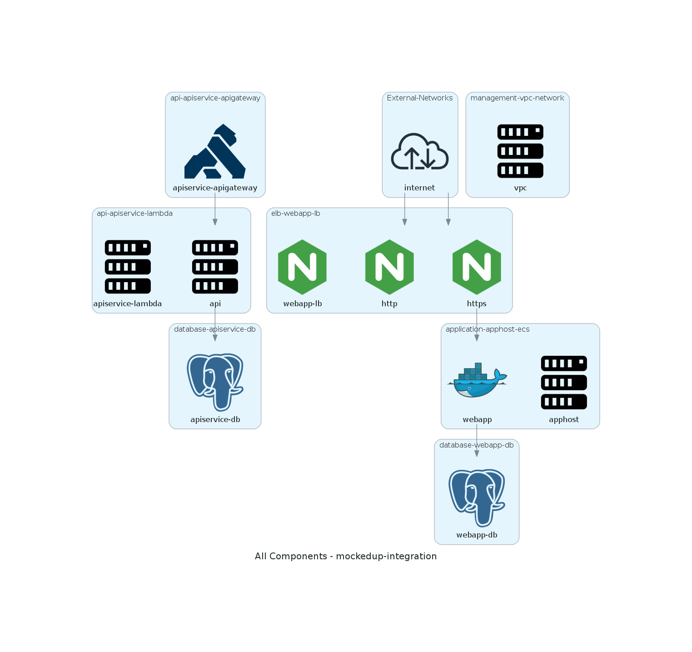
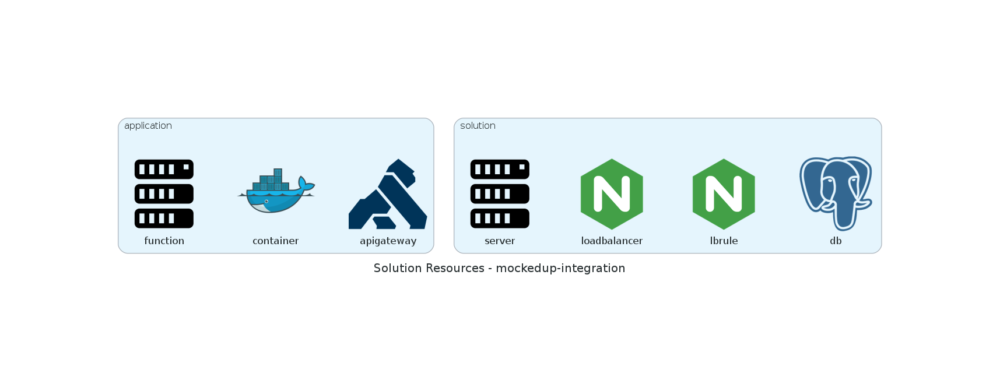
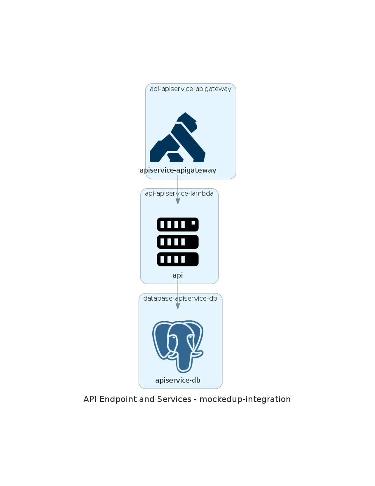

import Admonition from 'react-admonitions';

Instead of defining the raw infrastructure we need, hamlet works off a solution. The solution outlines the functional components required in the deployment and hamlet then takes this to build out the infrastructure definition that would perform this function.

Combining this with our pluggable architecture we can use the same solution to generate infrastructure definitions in different cloud providers like AWS and Azure. This is an interesting feature itself but in this post we are going to look at another way to use this data, diagram generation.

## A picture paints a 1000 words

Declarative infrastructure deployments that outline the precise configuration required for an infrastructure deployment, have become the standard with hyperscale cloud providers. However they can also be quite challenging to conceptualise what has been deployed.

Once the infrastructure has been deployed a common practice is to create diagrams which represent what has been deployed. These are mostly generated manually or through tools like cloudcraft which scan a deployment to build out the diagram. This can be a useful approach as a validation tool, however they can sometimes miss out on contextual information or even infrastructure which isn't supported by the tool.

With hamlet our diagrams are generated using the same solution file that defined the infrastructure. This means we keep the information in lockstep between whats deployed and what has been documented, and we can also include solution level information like environments, standard naming and multi-provider support

## Get to it

So lets see what this thing can do

1. Start up a hamlet container and mount the container home drive to a local directory

    ```bash
    docker run -it -v ~/hamlet_diagrams/:/home/hamlet/cmdb hamletio/hamlet
    ```

    :::info
    The `~/hamlet_diagrams/` can be whatever works for on your local system.
    We need the local mount so that we can view the diagram files created ( they will be png files )
    :::

2. Lets have a look at the diagram types that are available from hamlet. A diagram type is the structure of the diagram to generate

    ```bash
    hamlet visual -i mock -p diagramstest -p diagrams list-diagram-types
    ```

    ```bash
    ╒════╤═══════════╤══════════════════════════════════════════════════════════════════════════════════════════╕
    │    │ Type      │ Description                                                                              │
    ╞════╪═══════════╪══════════════════════════════════════════════════════════════════════════════════════════╡
    │  0 │ solution  │ A solution level diagram focussing on components and their relationships                 │
    ├────┼───────────┼──────────────────────────────────────────────────────────────────────────────────────────┤
    │  1 │ resources │ Shows all resources that are used in a segment and the deployment group they are used in │
    ╘════╧═══════════╧══════════════════════════════════════════════════════════════════════════════════════════╛
    ```

    The diagrams provider currently has two diagram types
     - the solution shows components and their relationships based on links
     - resources which shows the different infrastructure resource types found in the solution

3. Now lets have a look at what diagrams are available in this solution

    ```bash
    hamlet visual -i mock -p diagramstest -o diagrams list-diagrams
    ```

    ```bash
    ╒════╤════════════════╤═══════════╤═════════════════════════════════════════════════════════════════╕
    │    │ Id             │ Type      │ Description                                                     │
    ╞════╪════════════════╪═══════════╪═════════════════════════════════════════════════════════════════╡
    │  0 │ overview       │ solution  │ A solution level diagram of all components in the solution      │
    ├────┼────────────────┼───────────┼─────────────────────────────────────────────────────────────────┤
    │  1 │ resources_used │ resources │ Provides a diagram of all unique resources used in the solution │
    ╘════╧════════════════╧═══════════╧═════════════════════════════════════════════════════════════════╛
    ```

    We have two digrams that we can draw in the test provider

    - **overview** uses the solution diagram type to show all the components
    - **resources_used** shows us all the resources in our solution using the resources type

4. Now lets draw these diagrams to see what we get

    ```bash
    hamlet visual -i mock -p diagramstest -p diagrams draw-diagrams -d /home/hamlet/cmdb
    ```

    ```bash
    [*] overview
    [*] resources_used
    ```

    In the local directory we mounted to the docker container there are now two png files. One called `diagram-overview.png` and one called `diagram-resources_used.png`

    

    This diagram outlines the different components, each group is a component with each of their occurrences drawn inside them.
    - The `application-apphost-ecs` shows a container host, **apphost** with a single container service called **webapp**
    - The **https** load balancer rule in the **elb-webapp-lb** component has a link to this container
    - The **https** load balancer as an incoming link from the **internet**.

    

    This diagrams shows the different infrastructure resources in the solution overall.
    - At the application level function, container and apigateway
    - At the solution level server, load balancer, load balancer rule and database instance

## Where did that come from?

So that was pretty simple! We made some diagrams, they show us what's deployed and they are pretty easy to follow.

Lets have a look at the solution configuration for our overview components and see where the diagram got the information:

```json
    {
        "Tiers" : {
            "elb" : {
                "Components" : {
                    "webapp-lb" : {
                        "lb" : {
                            "Instances" : {
                                "default" : {
                                    "DeploymentUnits" : ["diagramstest-webapp-lb"]
                                }
                            },
                            "IPAddressGroups" : [ "_global" ],
                            "PortMappings" : {
                                "http" : {
                                    "Redirect" : {
                                    }
                                },
                                "https" : {
                                    "Forward" : {

                                    }
                                }
                            }
                        }
                    }
                }
            },
            "app" : {
                "Components" : {
                    "apphost" : {
                        "ecs" : {
                            "Instances" : {
                                "default" : {
                                    "DeploymentUnits" : [ "diagramstest-webapp-apphost" ]
                                }
                            },
                            "Services" : {
                                "webapp" : {
                                    "Instances" : {
                                        "default" : {
                                            "DeploymentUnits"  : [ "diagramstest-webapp-webapp" ]
                                        }
                                    },
                                    "Containers" : {
                                        "web" : {
                                            "CPU" : 128,
                                            "Memory" : 256,
                                            "Links" : {
                                                "db" : {
                                                    "Tier" : "db",
                                                    "Component" : "webapp-db",
                                                    "Instance" : "",
                                                    "Version" : ""
                                                }
                                            },
                                            "Ports" : {
                                                "http" : {
                                                    "LB" : {
                                                        "Tier" : "elb",
                                                        "Component" : "webapp-lb",
                                                        "PortMapping" : "https",
                                                        "Instance" : "",
                                                        "Version" : ""
                                                    }
                                                }
                                            }
                                        }
                                    }
                                }
                            }
                        }
                    }
                }
            }
        }
    }
```

- The load balancer is defined in the solution as webapp-lb and it has two port mappings *http* and *https*
- The load balancer has an `IPAddressGroups` configuration set to `_global` which is a special IP address group in hamlet which maps to the IP Range `0.0.0.0/0`. In the diagram this is represented by the internet external network
- On the apphost there is a service called webapp with a web container, again this aligns with the diagram. The Container has a link to the webapp-lb load balancer and its https port mapping.

To generate the diagram hamlet looks through the component configuration and looks for key sections of the configuration that would be useful to represent.
Each diagram type looks for different things:

- Solution type focuses on Links, IPAddress Groups and the Occurrences which are defined in the solution
- Resources uses the resources defined in an Occurrences state to find unique resources used in the solution

Considering the wide range of information that hamlet builds about a solution, we can start to see the potential for what could be represented using this approach. You can write your own plugins which implement diagram types based on pretty much anything in the hamlet engine.

## What are those random things?

So looking at the overview diagram you might notice that there are what looks like two different paths through the solution, the Internet -> load balancer -> container -> database path we followed before and another one which goes from an API Gateway -> Lambda -> Database. What if I wanted to show these on two different diagrams. This is why we have diagram types and diagrams in the plugin.

So lets have a look at a diagram definition:

```json
    {
        "Diagrams" : {
            "overview" : {
                "Type" : "solution",
                "Title" : "All Components",
                "Description" : "A solution level diagram of all components in the solution",
                "Rules" : {
                    "allComponents" : {
                        "Action" : "Include",
                        "Policy" : "ComponentType",
                        "policy:ComponentType" : {
                            "Types" : [ "*" ]
                        }
                    }
                }
            }
        }
    }
```

A diagram has two key configuration sections `Type` which picks the diagram type you want to use and `Rules` which defines what should be included in the diagram. We have a collection of policies available to help pick what is included.

- Links: uses the standard link based structure to explicitly define the components to include
- ComponentType: Filters occurrences based on their component type ( "*" means any)
- ResourceType: Filters based on the types of resources in an occurrence

These filters are available for all diagram types, some policies might be better suited to different types.

So if we wanted to split out the API Gateway and the web app we could define the following diagrams

```json
    {
        "Diagrams" : {
            "apiservice" : {
                "Type" : "solution",
                "Title" : "API Endpoint and Services",
                "Description" : "Our API Endpoint and its dependencies",
                "Rules" : {
                    "apiLinks" : {
                        "Action" : "Include",
                        "Policy" : "Links",
                        "policy:Links" : {
                            "Links" : {
                                "apigw" : {
                                    "Tier" : "api",
                                    "Component" : "apiservice-apigateway",
                                    "Instance" : "",
                                    "Version" : ""
                                },
                                "apilambda" : {
                                    "Tier" : "api",
                                    "Component" : "apiservice-lambda",
                                    "Function" : "api",
                                    "Instance" : "",
                                    "Version" : ""
                                },
                                "apidb" : {
                                    "Tier" : "db",
                                    "Component" : "apiservice-db",
                                    "Instance": "",
                                    "Version" : ""
                                }
                            }
                        }
                    }
                }
            }
        }
    }
```

Now if we create this diagram

```bash
hamlet visual -i mock -p diagramstest -p diagrams draw-diagrams --asset-dir ./ --diagram-id apiservice
```

```bash
[*] apiservice
```



We can just see those specific components and their relationships

## Creating your own diagrams

This post used the diagramstest plugin which provides a predefined solution that we use for testing the diagrams plugin. This was a simple way to show how the plugin works and what you can do. If you would like to draw the same diagrams we created in the post using your own solution you need to install the diagrams plugin in your solution

1. Add the following to your product CMDB to install the diagrams plugin and enable the diagrams overview module which includes the diagrams that we used in the demo

    ```json
    {
        "Product" : {
            "Plugins" : {
                "diagrams" : {
                    "Enabled" : true,
                    "Name" : "diagrams",
                    "Priority" : 100,
                    "Required" : true,
                    "Source" : "git",
                    "Source:git" : {
                        "Url" : "https://github.com/hamlet-io/engine-plugin-diagrams",
                        "Ref" : "main",
                        "Path" : "diagrams/"
                    }
                }
            }
        },
        "Solution" : {
            "Modules" : {
                "diagrams_overviews" : {
                    "Provider" : "diagrams",
                    "Name" : "overviews"
                }
            }
        }
    }
    ```

2. Install the plugin locally. In your segment solutions dir run

    ```bash
    ${GENERATION_DIR}/setup.sh
    ```

3. Generate the diagrams

    ```bash
    hamlet visual -i mock -p diagramstest -p diagrams draw-diagrams -d /home/hamlet/cmdb/mysolution
    ```

## Wrap Up

So that was the diagrams plugin for hamlet. It's a pretty easy way to build a broader understanding of whats in your solution and how things work together without having to do a whole lot of work.

You can get more information on the plugin from the Github Repo https://github.com/hamlet-io/engine-plugin-diagrams/.

The icons in the diagrams we went through in the post are general purpose ones which cover the functionality rather than a specific provider implementation. If you want to include provider specific icons you can also install the provider diagrams plugins available in our [AWS](https://github.com/hamlet-io/engine-plugin-aws/) and [Azure](https://github.com/hamlet-io/engine-plugin-azure/) plugin repos which will change the icons for the provider you want to use. Within the repo they plugins are called `awsdiagrams` and `azurediagrams`
