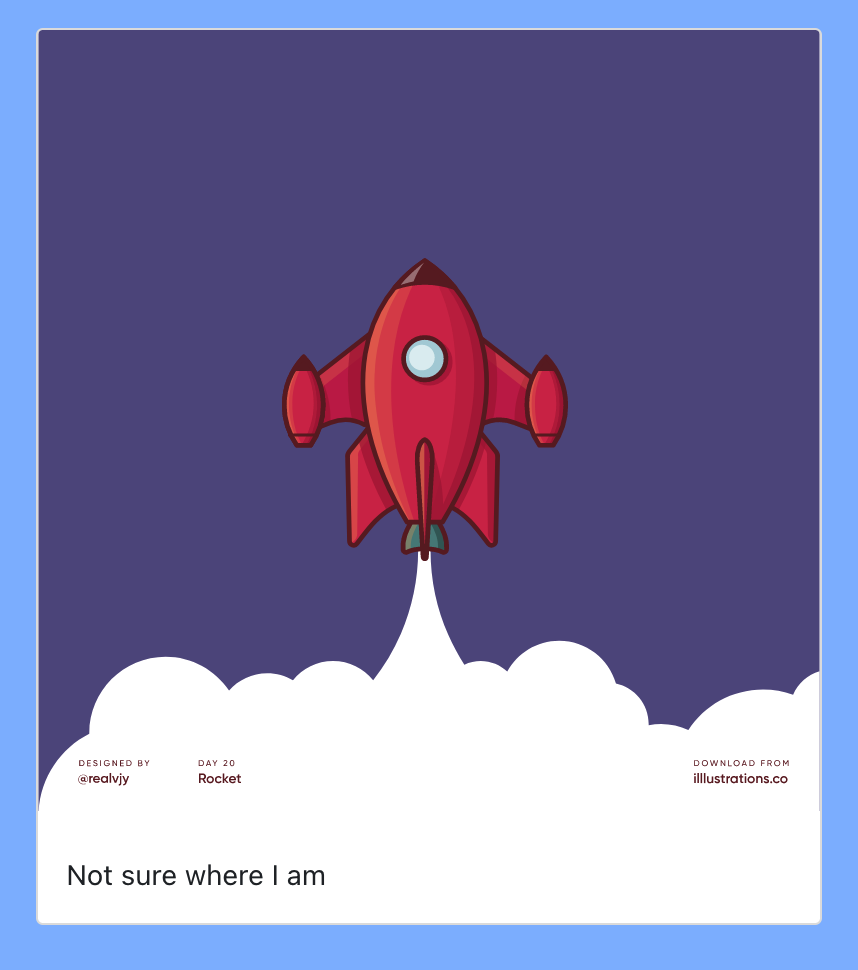
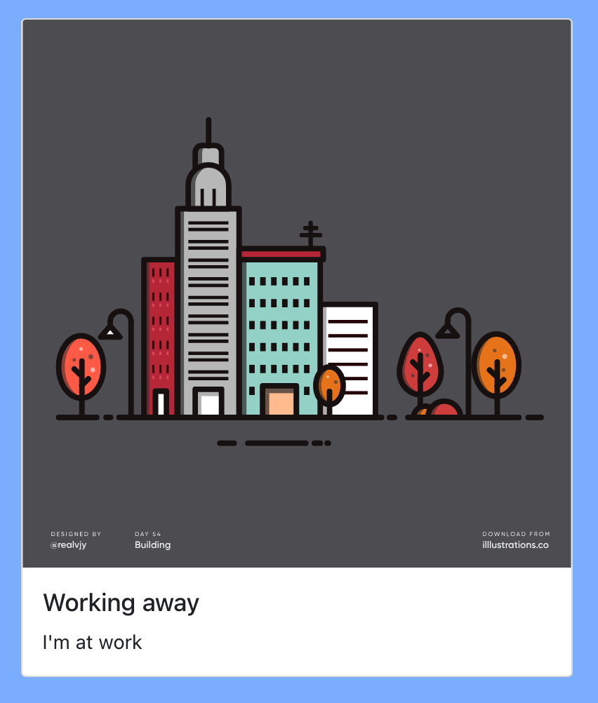

This guide works through the build and deployment of a React based UI for the API that we deployed in the [API deployment](../deploy-container/hamlet-hello-api.md).
Let's have a look at what the UI does locally, like we did with the API deployment.

## Running Locally

:::tip
The UI uses nodejs to build the application. Here is what we'll need to install to build the app:

- [nodejs](https://nodejs.org/en/) which provides the runtime to build our app
- [yarn](https://yarnpkg.com/getting-started) which provides package management for the app.

:::

In your local shell run the following:

```bash
# clone the docs support repo locally
cd ~/hamlet_hello/
git clone https://github.com/hamlet-io/docs-support

# change into the ui directory
cd docs-support/hello_world_ui

# install the required packages
yarn install

# start the application locally
yarn start
```

This should take you to a browser page ( if it doesn't head to http://localhost:3000 in your local browser ) that shows the My Status Web app.



It's a simple page that shows a greeting, a location and an image based on the location. At this stage the app doesn't know our location and it doesn't have a greeting. We need an API to get these details.

Let's set up the API and see what the UI will do.

In a new shell run the following:

```bash
docker run -p 8000:8000 -e LOCATION="work" -e GREETING="Working away" ghcr.io/hamlet-io/docs-support/hello_world:latest
```

This will start the API and make it available at http://localhost:8000

In the shell you started the UI from, cancel the current UI process with a break ( ctr + c on osx) and run the following in that shell:

```bash
export REACT_APP_API_URL=http://localhost:8000
yarn start
```

Setting the REACT_APP_API_URL tells the UI where to get the status update from. The UI should update to show a new status and include our greeting.



The location and the greeting have both come from the API and are being displayed by the UI. The UI will check the API periodically to see if the status has changed.

Now that we've seen what the API and UI do, you can break both the UI and API to stop them running.
