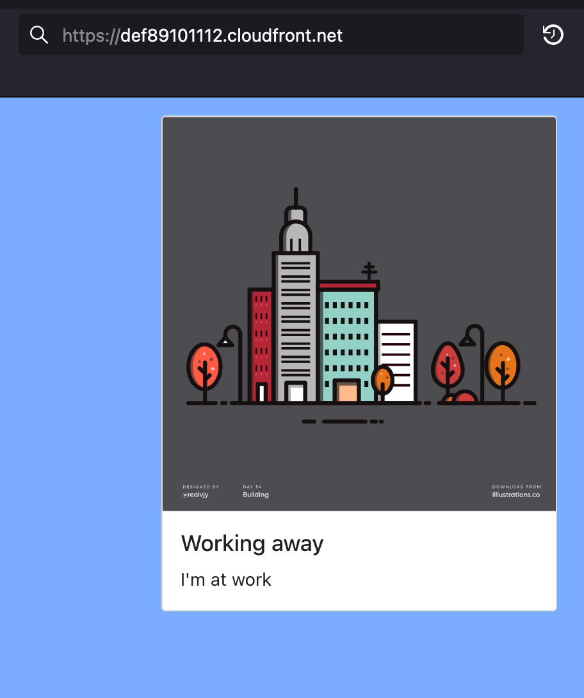

We've run our build and testing of the application, created a production build of the hello world UI and uploaded it as an image to hamlet. The last step in the process is to deploy it into our hamlet segment.

## Deploying a single page application

The image that we have for the UI was provided to hamlet as an SPA (single page application). Since SPA application logic is run from the user's browser we don't need to have a server running it. In hamlet the app image is hosted on an S3 bucket and this bucket is then made available through a CloudFront distribution. This provides a highly scalable and cached deployment of our single page application.

In hamlet we use two component types to create this deployment:

- **cdn** -In AWS, this is a CloudFront distribution with a set of routes. Each route forwards traffic to a different backend and the content is cached to speed up the site.
- **spa** - This is the S3 based storage of the app image. The content is hosted on the baseline ops data bucket that was deployed as we set up the segment. When deploying the component, the build reference for the application is used to pull the correct image from the registry and then expand it into the bucket. The SPA component doesn't deploy any new resources and just uses what is available.

Now let's update the solution to include the required components.

### Solution updates

1. From your terminal change into the segment within your CMDB.

    ```bash
    cd ~/hamlet_hello/mycmdb/myapp/config/solutionsv2/integration/default/
    ```

1. Open the segment.json file in this directory in your code editor and add the following:

    ```json
    {
        "Tiers" : {
            "web" : {
                "Components" : {
                    "hellouicdn" : {
                        "Type" : "cdn",
                        "deployment:Unit" : "hellouicdn",
                        "Routes" : {
                            "default" : {
                                "Origin" : {
                                    "Link" : {
                                        "Tier" : "web",
                                        "Component" : "helloui"
                                    }
                                },
                                "PathPattern" : "_default",
                                "Compress" : true
                            }
                        }
                    },
                    "helloui": {
                        "Type" : "spa",
                        "deployment:Unit" : "helloui",
                        "Links": {
                            "cdn": {
                                "Tier": "web",
                                "Component": "hellouicdn",
                                "Route" : "default",
                                "Direction": "inbound"
                            }
                        }
                    }
                }
            }
        }
    }
    ```

    This adds two new components, the CDN and the SPA. The SPA has the same deployment unit name as the image we uploaded in the last guide. The details of the image will be looked up during the component deployment processing and used by the component.

    The CDN links to the SPA as its origin and uses the default path to make it available at the root of the CDN URL.

    The SPA has a link back to the CDN with a direction of inbound. The direction means that instead of the link performing an action on the component that the link comes from, the link will perform an action on the destination. In this case, when the SPA is updated the CDN cache will be invalidated. This ensures that the latest image is available as soon as a deployment is completed.

1. Now run the deployment of the new components:

    ```bash
    hamlet --account acct01 deploy run-deployments -u hellouicdn -u helloui
    ```

    This will create the CDN ( this may take a while ). Once the process has completed the image will be unzipped and the contents copied to the component's s3 prefix.

1. Once the deployment has completed we need the URL for the CDN. We can find this using hamlet.

    ```bash
    hamlet --account acct01 component describe-occurrence -n web-hellouicdn-cdn attributes
    ```

    ```terminal
    | Key             | Value                                 |
    |-----------------|---------------------------------------|
    | FQDN            | def89101112.cloudfront.net            |
    | DISTRIBUTION_ID | DEF789DEF78                           |
    | INTERNAL_FQDN   | def89101112.cloudfront.net            |
    | URL             | https://def89101112.cloudfront.net    |
    ```

    Copy the URL value and paste it into your browser and you should see the Hello Status website.

    

## Wrap up

This guide has covered the initial deployment of our hello status API and a single page app that is linked to our API.
hamlet has managed the deployment of the whole application and we've been able to find out what has been deployed and how we can access it.
